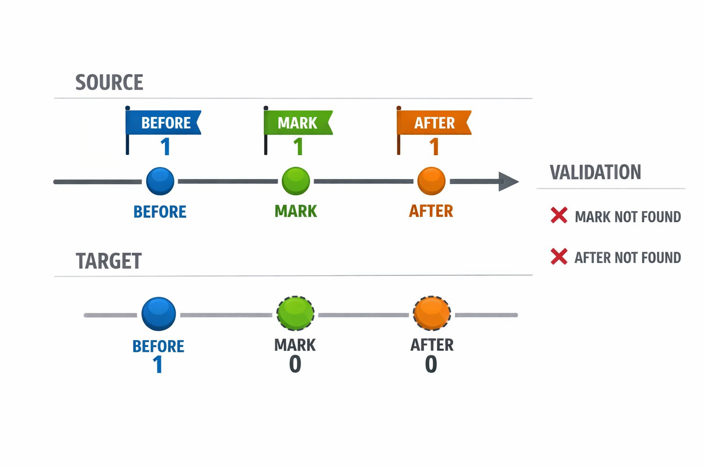
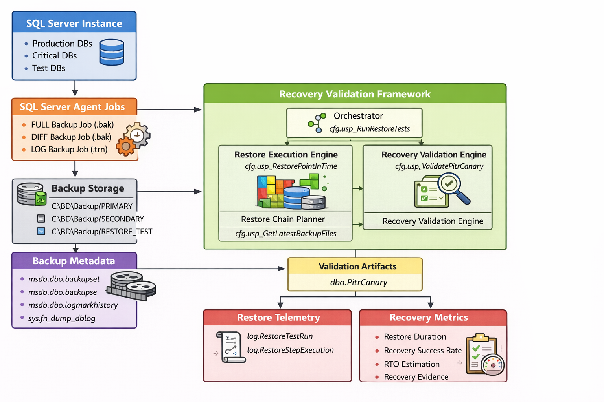

<p align="center">
  
</p>

<h1 align="center">SQL Server Recovery & Validation Framework</h1>

<p align="center">
  Production-oriented SQL Server backup, restore-chain planning, point-in-time recovery, and automated recoverability validation.
</p>

<p align="center">
  <a href="docs/architecture.md">Architecture</a> |
  <a href="docs/evidence/evidence.md">Evidence</a> |
  <a href="docs/use-cases/use-cases.md">Use Cases</a> |
  <a href="docs/architecture/scope-and-assumptions.md">Scope & Assumptions</a>
</p>

---

## The problem

In many SQL Server environments:

- backups are generated successfully;
- recovery is assumed rather than continuously proven;
- restore-chain construction depends on manual interpretation;
- incident response begins with uncertainty.

When failure occurs, teams need to answer quickly:

- Is the backup chain valid?
- Which FULL / DIFF / LOG files are required?
- Can the database be recovered to the exact required point?
- Can a logical business boundary be used instead of an imprecise timestamp?
- Can recoverability be tested before a real incident?

## The idea

A backup is only valuable if it can be **recovered with certainty**.

This framework treats recoverability as an operational capability that can be:

- scheduled;
- measured;
- tested;
- audited;
- repeated.

It combines metadata-driven backup scheduling, deterministic restore-chain selection, point-in-time recovery, marked-transaction rollback, canary validation, and persisted telemetry.

## At a glance

| Area | Implementation |
|---|---|
| Platform | Microsoft SQL Server |
| Language | T-SQL |
| Backup types | FULL / DIFF / LOG |
| Scheduling | Metadata-driven policy engine |
| Scheduler protection | `sp_getapplock` prevents overlapping scheduler runs |
| Restore modes | `STOPAT` and `STOPBEFOREMARK` |
| Restore-chain planning | SQL Server backup history / `msdb` metadata |
| Validation | Canary-based restore testing |
| Integrity check | Optional `DBCC CHECKDB` after restore |
| Telemetry | Backup runs, restore-test runs, step execution detail |
| Evidence | Backup, scheduler, restore, and recovery-use-case proof |
| Primary objective | Prove recoverability, not merely backup completion |
| Project status | Completed / portfolio-ready reliability framework |

## What this framework solves

### Forensic recovery — `STOPAT`

Recover toward the correct incident boundary when the exact failure time must be narrowed through controlled validation.

### Deterministic rollback — `STOPBEFOREMARK`

Restore to a precise transaction mark aligned with a known business or deployment event.

### Recovery validation

Prove that backup chains are actually usable by executing controlled restore tests and validating expected canary state.

<p align="center">
  
</p>

## Architecture

<p align="center">
  
</p>

The framework separates responsibilities across:

- configuration and policy metadata;
- backup scheduling and execution;
- restore-chain planning;
- restore orchestration;
- canary validation;
- execution telemetry and evidence.

See [Architecture](docs/architecture.md) for the full design.

## Backup scheduling

The scheduler evaluates backup eligibility from metadata rather than hard-coded per-database jobs.

It determines the most appropriate action using policy and execution history, including:

- database tier;
- RPO / RTO metadata;
- FULL / DIFF / LOG cadence;
- recovery model;
- previous successful backups;
- whether a backup is already running.

Backup precedence is:

```text
FULL > DIFF > LOG
```

Concurrent scheduler executions are blocked through `sp_getapplock`.

<p align="center">
  
</p>

## Recovery execution

The restore engine supports:

```text
STOPAT
STOPBEFOREMARK
```

A restore run can:

1. resolve the required restore chain;
2. restore FULL / DIFF / LOG backups in deterministic order;
3. stop at a time or marked transaction boundary;
4. persist step-level execution telemetry;
5. optionally run `DBCC CHECKDB`;
6. expose a run identifier for traceability.

The framework is designed for controlled validation and recovery workflows rather than ad-hoc manual restore guesswork.

## Canary-based validation

`cfg.usp_RunRestoreTests` creates controlled BEFORE / MARK / AFTER canary evidence around a recovery boundary.

The restored database can then be evaluated to confirm that the expected logical state exists at the selected recovery point.

This turns the question:

> “Did the restore command finish?”

into the stronger question:

> “Did the restored database reach the state we expected?”

## Evidence

Execution evidence is organized under:

```text
docs/evidence/
```

It includes:

- backup execution evidence;
- restore validation;
- scheduler behavior scenarios;
- canary validation;
- screenshots and execution traces.

See [Evidence](docs/evidence/evidence.md).

## Real-world recovery use cases

The repository documents two primary recovery scenarios:

| Recovery approach | Use case |
|---|---|
| `STOPAT` | Recover data after an accidental update |
| `STOPBEFOREMARK` | Roll back a release using a marked transaction |

See [Use Cases](docs/use-cases/use-cases.md).

## Core implementation

Key framework objects include:

### Configuration / execution procedures

- `cfg.usp_RunScheduledBackups`
- `cfg.usp_BackupDatabase`
- `cfg.usp_BackupByTierAndType`
- `cfg.usp_GetLatestBackupFiles`
- `cfg.usp_RestorePointInTime`
- `cfg.usp_RunRestoreTests`
- `cfg.usp_ValidatePitrCanary`

### Configuration and telemetry tables

- `cfg.Tier`
- `cfg.DatabasePolicy`
- `cfg.BackupPaths`
- `log.BackupRun`
- `log.RestoreTestRun`
- `log.RestoreStepExecution`
- `dbo.PitrCanary`

Implementation SQL is versioned under `sql/`; procedural documentation is available under `docs/procedures/`.

## Design principles

The framework favors:

- deterministic recovery over best-effort approaches;
- non-destructive validation where possible;
- metadata-driven policy instead of duplicated jobs;
- traceable execution;
- evidence-driven recovery testing;
- explicit operational boundaries.

## Scope boundaries

This is a SQL Server recovery-validation framework, not a complete infrastructure-level disaster-recovery platform.

The documented scope intentionally excludes areas such as:

- non-SQL Server backup systems;
- storage or network failure remediation;
- high-availability / replication orchestration;
- physical infrastructure recovery.

See [Scope and Assumptions](docs/architecture/scope-and-assumptions.md) for the complete boundary.

## Repository structure

```text
.
├── README.md
├── diagrams/
├── docs/
│   ├── architecture/
│   ├── evidence/
│   ├── procedures/
│   └── use-cases/
└── sql/
    ├── 01_Tables/
    └── cfg/
```

## Why this matters

Backup success is not the same thing as recovery readiness.

This project demonstrates a reliability-oriented DBA approach in which recovery can be planned, executed, validated, and evidenced before an actual incident forces the question.

## Status

**Completed / portfolio-ready reliability framework.**
