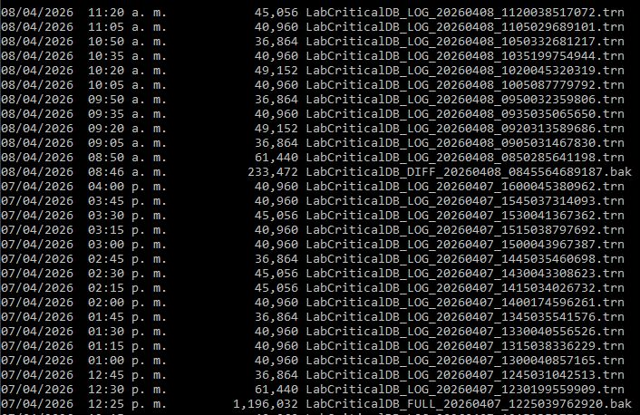
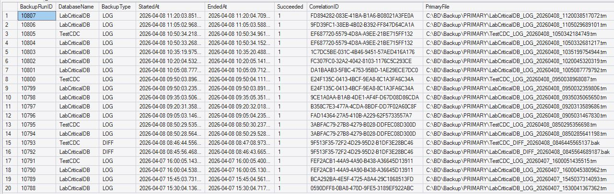

<p align="center">
<a href="../../README.md">Home</a> |
<a href="evidence.md">Back</a>
</p>

# Backup Execution

This section provides real execution evidence of the framework operating under a **policy-driven scheduling model**.

The objective is to demonstrate that backup operations are:

- Dynamically determined at runtime  
- Executed according to defined policies  
- Properly recorded in telemetry  
- Consistent with expected operational cadence  

## Scenario - Policy Configuration

- Tier 0 (Critical)
  - FULL: Daily  
  - DIFF: Every 4 hours  
  - LOG: Every 15 minutes  

- Scheduler:
  - SQL Server Agent Job executes every **5 minutes**

# Step 1 — Decision Engine (Dry Run)

Execute the scheduler in validation mode:

```sql
EXEC cfg.usp_RunScheduledBackups
    @DryRun = 1,
    @Debug = 1;
```

### Expected Behavior:
- The procedure evaluates all databases
- Determines which backup type is due
- Returns a decision matrix without executing backups

🔍 Evidence: SSMS result showing decision output

<p align="center">
  
</p>

### Key Columns:
- DatabaseName
- SelectedBackupType
- DecisionReason
- LastFullAt / LastLogAt

### Interpretation
- `LabCriticalDB` → LOG due
- `TestCDC` → skipped Last log created at 09:50 am (Execution time: 10:05 am.)
- `WideWorldImporters` → skipped (SIMPLE recovery model)

This confirms that:
- Recovery model rules are respected
- Backup cadence is evaluated dynamically
- No unnecessary operations are scheduled

### Step 2 — Execute Scheduler

Run the scheduler in execution mode:

```sql
EXEC cfg.usp_RunScheduledBackups
    @DryRun = 0,
    @Debug = 1;
```

Expected Behavior
- Only databases with due backups are processed
- Backup type is selected per database
- Each execution is grouped by CorrelationID

### Step 3 — Backup Files Generated

The framework generates backup files in configured storage paths.

🔍 Evidence: File System Output

<p align="center">
  
</p>

Focus on:

- File naming convention
- Timestamp consistency
- Presence of LOG backups every ~15 minutes

Observed behavior:
- LOG backups follow a stable cadence (15-minute intervals)
- FULL backups do not disrupt LOG rhythm
- Backup files are consistently generated

This demonstrates that:
- The scheduler preserves operational cadence
- Backup execution is aligned with RPO objectives

### Step 4 — Telemetry Verification

Validate execution through telemetry tables.

```sql
SELECT TOP (20)
    BackupRunID, DatabaseName, BackupType, StartedAt, EndedAt,
    Succeeded, CorrelationID, PrimaryFile
FROM log.BackupRun
ORDER BY BackupRunID DESC;
```

🔍 Evidence: Telemetry Output

<p align="center">
  
</p>

Key observations:
- Multiple databases share the same CorrelationID → single scheduler execution
- Execution timestamps are consistent with scheduler trigger
- BackupType reflects correct decision logic (FULL / DIFF / LOG)
- Succeeded = 1 confirms successful execution

### Step 5 — Correlation Analysis

Each scheduler execution generates a unique CorrelationID.

🔍 Evidence: Correlation Consistency

<p align="center">
  
</p>

This confirms that:
- The framework groups operations per execution cycle
- Execution traceability is preserved
- Multi-database operations are logically linked

### Step 6 — Cadence Validation

Review LOG backup timing:

```sql
SELECT DatabaseName, BackupType, StartedAt
FROM log.BackupRun
WHERE DatabaseName = 'LabCriticalDB'
  AND BackupType = 'LOG'
ORDER BY StartedAt DESC;
```

🔍 Evidence: LOG Cadence

<p align="center">
  
</p>

Observed pattern:
- LOG backups executed at consistent intervals
- FULL backups do not reset LOG cadence

This validates:
- Stable RPO enforcement
- Continuous recoverability coverage

### Key Observations
- Backup decisions are made dynamically at runtime
- Execution is aligned with policy configuration
- No redundant backups are generated
- Telemetry provides full traceability
- LOG cadence remains consistent even after FULL execution

### Conclusion

This execution demonstrates that the framework:
- Operates as a policy-driven scheduling system
- Maintains consistent backup cadence
- Produces reliable and traceable execution records
- Ensures continuous data protection readiness

The system does not rely on static job definitions, but instead evaluates and executes backups based on real-time conditions and historical context.

