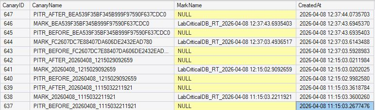

<p align="center">
<a href="../../README.md">Home</a> |
<a href="../examples/examples.md">Examples</a>
</p>

# Restore Validation Evidence

This section demonstrates the framework’s ability to perform **deterministic recovery validation** using controlled restore scenarios and data-level verification.

The objective is to prove that:

- Backup chains are valid and usable  
- Restore operations reach the intended recovery boundary  
- Data state matches expected conditions after recovery  
- Recovery is not assumed, but **verified with evidence**  

---

# Scenario

## Validation Strategy

The framework uses a [**canary-based validation model**](/references/canary-validation-model.md):

- Insert a record BEFORE the recovery boundary  
- Insert a MARK (transaction marker)  
- Insert a record AFTER the boundary  

Then:

- Restore the database **before the mark**  
- Validate that Target Database:
  - BEFORE exists ✅  
  - MARK does not exist ❌  
  - AFTER does not exist ❌  

---

# Step 1 — Execute Restore Validation

Run the orchestration procedure:

```sql
DECLARE	@return_value int

EXEC	@return_value = [cfg].[usp_RunRestoreTests]
		@DatabaseList = 'LabCriticalDB',
		@PrimaryDir = 'C:\BD\Backup\PRIMARY\',
		@SecondaryDir = 'C:\BD\Backup\SECONDARY\',
		@UseMirror = 0,
		@DoCheckDB = 1,
		@ReplaceTarget = 1,
		@KeepTargetDb = 1,
		@Debug = 1

SELECT	'Return Value' = @return_value
```

### Expected Behavior

The procedure:
- Inserts canary records
- Creates a marked transaction
- Generates a LOG backup capturing the mark
- Executes restore using STOPBEFOREMARK
- Validates restored data
  
🔍 Evidence: Executed restore chain

<p align="center">
  
</p>

 ### Output console:

 ```text
------------------------------
DBG Procedure    =[cfg].[usp_RunRestoreTests]
 
DBG DB           =[LabCriticalDB]
DBG TargetDB     =[LabCriticalDB_RestoreTest]
DBG Started at   =[2026-04-08 12:37:43.694]
 
DBG MarkDesc     =[LabCriticalDB_RT_2026-04-08 12:37:43.6935403]
DBG TranName     =[RT_436935403]
 
DBG CanaryBefore =[PITR_BEFORE_BEA539F35BF345B999F97590F637CDC0]
DBG CanaryMark   =[MARK_BEA539F35BF345B999F97590F637CDC0]
DBG CanaryAfter  =[PITR_AFTER_BEA539F35BF345B999F97590F637CDC0]
...
2.0: >>> INSERT BEFORE-CANARY >>> 
USE [LabCriticalDB]; 
INSERT INTO dbo.PitrCanary(CanaryName) VALUES (N'PITR_BEFORE_BEA539F35BF345B999F97590F637CDC0');

3.0: >>> INSERT MARK INSIDE MARKED-TRANSACTION  >>> 
USE [LabCriticalDB];
BEGIN TRAN [RT_436935403] WITH MARK N'LabCriticalDB_RT_2026-04-08 12:37:43.6935403';
    INSERT INTO dbo.PitrCanary(CanaryName, MarkName) VALUES (N'MARK_BEA539F35BF345B999F97590F637CDC0', N'LabCriticalDB_RT_2026-04-08 12:37:43.6935403');
COMMIT TRAN [RT_436935403];

4.0: >>> CREATING LOG-BACKUP #1 (THIS FILE CONTAINS MARK TO STOP IN) >>> 
BACKUP LOG [LabCriticalDB] TO DISK = N'C:\BD\Backup\PRIMARY\LabCriticalDB_LOG_MARK_20260408_1237436935403_01.trn' WITH INIT, CHECKSUM, COMPRESSION;                
                
Processed 9 pages for database 'LabCriticalDB', file 'LabCriticalDB_log' on file 1.
BACKUP LOG successfully processed 9 pages in 0.175 seconds (0.379 MB/sec).

5.0: >>> INSERT AFTER-CANARY >>> 
USE [LabCriticalDB]; 
INSERT INTO dbo.PitrCanary(CanaryName) VALUES (N'PITR_AFTER_BEA539F35BF345B999F97590F637CDC0');

6.0: >>> CREATING LOG-BACKUP #2 () >>> 
USE [LabCriticalDB]; 
BACKUP LOG [LabCriticalDB] TO DISK = N'C:\BD\Backup\PRIMARY\LabCriticalDB_LOG_MARK_20260408_1237436935403_02.trn' WITH INIT, CHECKSUM, COMPRESSION;
Processed 2 pages for database 'LabCriticalDB', file 'LabCriticalDB_log' on file 1.
BACKUP LOG successfully processed 2 pages in 0.154 seconds (0.101 MB/sec).
... 

DBG Ended at     =[2026-04-08 12:37:52.5555420] IN 8.861 seconds.
 
------------------------------
```
# Step 2 — Canary Generation

The framework creates controlled markers in the source database.

🔍 Evidence: Canarys created at Source Database
```sql
SELECT *
FROM dbo.PitrCanary
ORDER BY CreatedAt DESC;
```

<p align="center">
  
</p>

### Interpretation

This confirms that:
- The recovery boundary is clearly defined
- The test scenario is deterministic
- The restore validation has a measurable reference

# Step 3 — Restore Execution

The framework executes a restore using:
- FULL backup
- (Optional) DIFF
- LOG backups
- `STOPBEFOREMARK`

🔍 Evidence: Restored Target Database

<p align="center">
  
</p>

## Output console:

```text
------------------------------
DBG Procedure =[cfg].[usp_RestorePointInTime]
DBG Mode      =[STOPBEFOREMARK]
DBG SourceDB  =[LabCriticalDB]
DBG TargetDB  =[LabCriticalDB_RestoreTest]
DBG Started at=[2026-04-08 12:37:44.521]
 
DBG Stop Mark =[RT_436935403]
DBG Mark LSN  =[69000000365600004]
DBG Mark Time =[2026-04-08 12:37:43.693]
 
1.0: >>> RESTORE-CHAIN SUCCESSFULLY BUILT >>> 
3.1: >>> RESTORING... >>>
RESTORE DATABASE [LabCriticalDB_RestoreTest] FROM DISK = N'C:\BD\Backup\PRIMARY\LabCriticalDB_FULL_20260408_1225040376118.bak' WITH NORECOVERY, REPLACE, MOVE N'LabCriticalDB' TO N'C:\BD\Backup\RESTORE_TEST\LabCriticalDB_RestoreTest_DATA.mdf', MOVE N'LabCriticalDB_log' TO N'C:\BD\Backup\RESTORE_TEST\LabCriticalDB_RestoreTest_LOG.ldf';
Processed 856 pages for database 'LabCriticalDB_RestoreTest', file 'LabCriticalDB' on file 1.
Processed 2 pages for database 'LabCriticalDB_RestoreTest', file 'LabCriticalDB_log' on file 1.
RESTORE DATABASE successfully processed 858 pages in 0.242 seconds (27.682 MB/sec).
3.2: >>> RESTORING... >>>
RESTORE LOG [LabCriticalDB_RestoreTest] FROM DISK = N'C:\BD\Backup\PRIMARY\LabCriticalDB_LOG_20260408_1235035471679.trn' WITH NORECOVERY;
Processed 0 pages for database 'LabCriticalDB_RestoreTest', file 'LabCriticalDB' on file 1.
Processed 20 pages for database 'LabCriticalDB_RestoreTest', file 'LabCriticalDB_log' on file 1.
RESTORE LOG successfully processed 20 pages in 0.057 seconds (2.741 MB/sec).
3.3: >>> RESTORING... >>>
RESTORE LOG [LabCriticalDB_RestoreTest] FROM DISK = N'C:\BD\Backup\PRIMARY\LabCriticalDB_LOG_MARK_20260408_1237436935403_01.trn' WITH STOPBEFOREMARK = N'RT_436935403', RECOVERY;
Processed 0 pages for database 'LabCriticalDB_RestoreTest', file 'LabCriticalDB' on file 1.
Processed 9 pages for database 'LabCriticalDB_RestoreTest', file 'LabCriticalDB_log' on file 1.
RESTORE LOG successfully processed 9 pages in 0.053 seconds (1.252 MB/sec).
4.0: >>> SET DATABASE ACCES MULTI-USER >>> 
ALTER DATABASE [LabCriticalDB_RestoreTest] SET MULTI_USER;
4.1: >>> CHECK NEWLY-RESTORED DATABASE >>> 
DBCC CHECKDB([LabCriticalDB_RestoreTest]) WITH NO_INFOMSGS;
 
DBG Ended at     =[2026-04-08 12:37:52.3601374]
DBG Procedure    =[cfg].[usp_RestorePointInTime]: SUCCESSFULLY RUN! IN 7.839 seconds.
------------------------------
```

# Step 4 — Data-Level Validation

Validate the restored database:

```sql
SELECT *
FROM LabCriticalDB_RestoreTest.dbo.PitrCanary
ORDER BY CreatedAt DESC;
```

🔍 Source Canary Table

<p align="center">
  
</p>

🔍 Target Canary Table
<p align="center">
  
</p>


### Interpretation

This confirms that:
- The restore stopped at the correct boundary
- No data beyond the mark was applied
- The recovery point is precise and deterministic

# Step 5 — Telemetry Verification

Review restore execution records:

🔍 Evidence: Restore Telemetry

```sql
SELECT *
FROM log.RestoreTestRun
ORDER BY StartedAt DESC;
```
|Column| Value|
|---|---|
|RestoreRunID	| 10246|
|CorrelationID	|41865FAE-891D-42D5-B94F-811D73CA5989|
|StartedAt	|08/04/2026 12:37|
|EndedAt	|08/04/2026 12:37|
|SourceDatabase	|LabCriticalDB|
|TargetDatabase|	LabCriticalDB_RestoreTest|
|StopAt|	08/04/2026 12:37|
|FullBackupFile	|C:\BD\Backup\PRIMARY\LabCriticalDB_FULL_20260408_1225040376118.bak|
|DiffBackupFile|	NULL|
|LogBackupFilesCount|	2|
|DataFileTarget|	C:\BD\Backup\RESTORE_TEST\LabCriticalDB_RestoreTest_DATA.mdf|
|LogFileTarget|	C:\BD\Backup\RESTORE_TEST\LabCriticalDB_RestoreTest_LOG.ldf|
|CheckDbRequested|	1|
|CheckDbSucceeded|	1|
|Succeeded|	1|
|ErrorNumber|	NULL|
|ErrorMessage|	NULL|
|LogsBaseDate|	08/04/2026 12:25|
|DebugEnabled|	1|
|CanaryBeforeName|	PITR_BEFORE_BEA539F35BF345B999F97590F637CDC0|
|CanaryMarkName|	MARK_BEA539F35BF345B999F97590F637CDC0|
|CanaryAfterName|	PITR_AFTER_BEA539F35BF345B999F97590F637CDC0|
|CanaryValidated|	1|
|CanaryPassed|	1|
|CanaryMessage|	PITR Canary VALID: STOPBEFOREMARK respected. BEFORE exists in target; MARK and AFTER are absent.|
|MarkLogFile|	C:\BD\Backup\PRIMARY\LabCriticalDB_LOG_MARK_20260408_1237436935403_01.trn|

```sql
SELECT *
FROM log.RestoreStepExecution
ORDER BY RestoreRunID, StepOrder;
```

<p align="center">
  
</p>

### Interpretation

Key observations:
- Restore chain is fully recorded
- Each step contains LSN and timing data
- Errors (if any) are captured
- Canary validation results are stored

# Step 6 — Canary Validation Result

If using integrated validation:


```sql
SELECT
    CanaryBeforeName,
    CanaryMarkName,
    CanaryAfterName,
    CanaryPassed,
    CanaryMessage
FROM log.RestoreTestRun
ORDER BY StartedAt DESC;
```

🔍 Evidence: Validation Outcome
|Column| Value|
|-----|------|
|CanaryBeforeName|	PITR_BEFORE_BEA539F35BF345B999F97590F637CDC0|
|CanaryMarkName|	MARK_BEA539F35BF345B999F97590F637CDC0|
|CanaryAfterName|	PITR_AFTER_BEA539F35BF345B999F97590F637CDC0|
|CanaryPassed|	1|
|CanaryMessage|	PITR Canary VALID: STOPBEFOREMARK respected. BEFORE exists in target; MARK and AFTER are absent.|
  
# Step 7 — Manual Validation (Optional)

Run validation independently:

```sql
EXEC cfg.usp_ValidatePitrCanary
    @SourceDB = 'LabCriticalDB',
    @TargetDB = 'LabCriticalDB_RestoreTest',
    @Token = 'BEA539F35BF345B999F97590F637CDC0';
```

## Output console:

```text
------------------------------
DBG Procedure    =[cfg].[usp_ValidatePitrCanary]
DBG SourceDB     =[LabCriticalDB]
DBG TargetDB     =[LabCriticalDB_RestoreTest]
DBG Started at   =[2026-04-08 15:54:35.9202328]
 
DBG Canary Before=[PITR_BEFORE_BEA539F35BF345B999F97590F637CDC0]
DBG Canary Mark  =[MARK_BEA539F35BF345B999F97590F637CDC0]
DBG Canary After =[PITR_AFTER_BEA539F35BF345B999F97590F637CDC0]
 
             BEFORE       MARK        AFTER
SOURCE         1            1           1
TARGET         1            0           0
 
PITR Canary VALID!: STOPBEFOREMARK respected.
 
DBG Ended at     =[2026-04-08 15:54:35.9202328]
DBG Procedure    =[cfg].[usp_ValidatePitrCanary]: SUCCESSFULLY RUN! IN 0.000 seconds.
------------------------------
```

# Key Observations
- Restore chains are correctly constructed and executed
- Recovery boundaries are precisely respected
- Data-level validation confirms correctness
- Canary model provides deterministic verification
- Telemetry captures full execution trace

# Conclusion

This execution demonstrates that the framework:

Does not assume recoverability — it proves it
Validates both technical and functional correctness
Provides measurable, repeatable recovery validation
Ensures that backup strategies are not only implemented, but continuously verified

The result is a system where recovery capability is not theoretical, but **tested, validated, and evidenced.**
