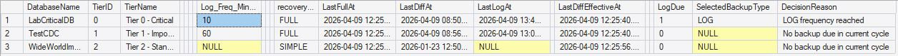
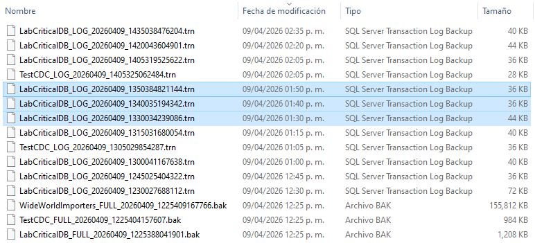

<p align="center">
<a href="../../README.md">Home</a> |
<a href="scheduler-behavior.md">Back</a>
</p>

# Scenario 10 — Dynamic Policy Change
### Tier configuration or database policy is modified.

```sql
UPDATE cfg.Tier
SET Log_Freq_Minutes = 10
WHERE TierID = 0;
```

### 🔍 Evidence
  - Scheduler adapts immediately
<p align="center">
  
</p>

  - New frequency is applied without restart
<p align="center">
  
</p>

### Interpretation
  - System is fully metadata-driven
  - No job changes required
  - Behavior adjusts dynamically
