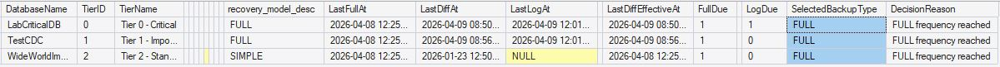
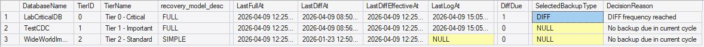
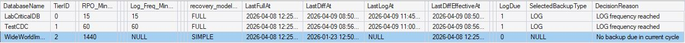
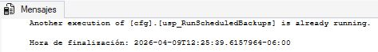

<p align="center">
<a href="../../README.md">Home</a> |
<a href="../architecture.md">Architecture</a>
</p>

# Scheduler Behavior

This section demonstrates how the framework behaves under different runtime conditions when executing the policy-driven scheduler:

- [`cfg.usp_RunScheduledBackups`](../../docs/procedures/usp_RunScheduledBackups.md)

The goal is to validate that the system:

- Makes correct decisions based on configuration  
- Adapts dynamically to changing conditions  
- Maintains operational consistency  
- Avoids unnecessary or redundant executions  

---

# Overview

The scheduler operates under a **trigger-based model**:

  - A SQL Server Agent Job runs every 5 minutes  
  - The procedure evaluates all databases  
  - Decisions are made dynamically using:
  - Configuration ([`[cfg].[Tier]`](../../sql/01_Tables/cfg.Tier.md), [`[cfg].[DatabasePolicy]`](../../sql/01_Tables/cfg.DatabasePolicy.md))  
  - Execution history ([`[log].[BackupRun]`](../../sql/01_Tables/log.BackupRun.md))  

### Execution

```sql
EXEC cfg.usp_RunScheduledBackups
    @DryRun = 1,
    @Debug = 1;
```
---

  - [Scenario 1 — No Backup Due](scheduler-behavior-1.md)
  - [Scenario 2 — LOG Backup Due](scheduler-behavior-2.md)


# Scenario 3 — FULL Backup Due
### Full backup frequency threshold has been reached.

### 🔍 Evidence
  - `FullDue = 1`
  - `SelectedBackupType = FULL`

<p align="center">
  
</p>

### Interpretation
  - FULL backups take precedence over other types
  - Baseline reset is correctly applied
  - DIFF chain integrity is preserved

--- 

# Scenario 4 — DIFF Backup Due
### Differential backup is required based on effective baseline.

### 🔍 Evidence
  - `DiffDue = 1`
  - `SelectedBackupType = DIFF`

<p align="center">
  
</p>

### Interpretation
  - DIFF is evaluated against the latest effective baseline (FULL or DIFF)
  - Restore chain consistency is maintained

# Scenario 5 — Recovery Model Constraint
### Database is configured with SIMPLE recovery model.

### 🔍 Evidence
  - `recovery_model_desc = SIMPLE`
  - `SelectedBackupType = NULL`

<p align="center">
  
</p>

### Interpretation
  - LOG backups are correctly skipped
  - Recovery model rules are enforced
  - No invalid operations are attempted

# Scenario 6 — FULL Does Not Reset LOG Cadence
## A FULL backup is executed, followed shortly by a scheduler cycle.

### 🔍 Evidence
  - Recent FULL backup exists
  - LOG backup 5 minutes after
  - LOG backup rate follows own timing rules
  
<p align="center">
  
</p>
    
### Interpretation
  - LOG cadence remains stable
  - FULL backups do not reset LOG timing
  - RPO is preserved independently

# Scenario 7 — Multiple Databases, Independent Decisions
### Multiple databases evaluated in a single execution cycle.

### 🔍 Evidence

<p align="center">
  
</p>

### Interpretation
  - Each database is evaluated independently
  - Different decisions can coexist in the same cycle
  - Scheduler behaves as a per-database decision engine

# Scenario 8 — Correlation Across Execution
### Multiple backups executed within the same scheduler run.

### 🔍 Evidence
```sql
SELECT DatabaseName, BackupType, CorrelationID
FROM log.BackupRun
ORDER BY StartedAt DESC;
```
<p align="center">
  
</p>

### Interpretation
  - All operations share a common CorrelationID
  - Execution grouping is preserved
  - Traceability across operations is ensured

# Scenario 9 — Backup Already in Progress
### A backup operation is currently running.

### 🔍 Evidence
  - Database is skipped

<p align="center">
  
</p>

### Interpretation
  - The scheduler avoids overlapping operations
  - Concurrency control is enforced
  - System stability is preserved

# Scenario 10 — Dynamic Policy Change
### Tier configuration or database policy is modified.

```sql
UPDATE cfg.Tier
SET Log_Freq_Minutes = 10
WHERE TierID = 0;
```

### 🔍 Evidence
  - Scheduler adapts immediately
<p align="center">
  
</p>

  - New frequency is applied without restart
<p align="center">
  
</p>

### Interpretation
  - System is fully metadata-driven
  - No job changes required
  - Behavior adjusts dynamically

# Key Observations
  - Decisions are made at runtime, not predefined
  - Backup execution is demand-driven
  - System adapts instantly to configuration changes
  - Operational cadence is preserved
  - Concurrency and integrity constraints are enforced

# Conclusion

The scheduler behaves as a dynamic decision engine, not a static job executor.

It ensures that:

  - Backups are executed only when required
  - Policies are consistently enforced
  - System behavior remains predictable and traceable

This transforms backup scheduling into an adaptive, policy-driven system aligned with real operational needs.


