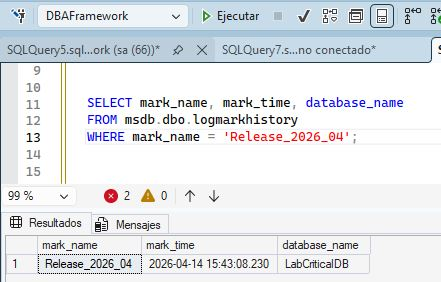

<p align="center">
<a href="../../README.md">Home</a> |
<a href="../architecture.md">Architecture</a> |
<a href="../examples/examples.md">Examples</a>
</p>

# STOPBEFOREMARK Restore for Release Rollback

---

## Overview

This use case demonstrates a **deterministic rollback strategy** using transaction marks (`STOPBEFOREMARK`) to recover a database to a precise logical point.

Unlike time-based recovery (`STOPAT`), this approach enables:

- exact rollback to a known business event  
- deterministic recovery without approximation  
- alignment with release management processes  

---

## Business context

The QA team is preparing a **major release deployment** in a pre-production environment.

As part of the release process:

- deployment scripts are executed  
- data transformations are applied  
- validation scenarios are tested  

To ensure recoverability, a **transaction mark** is created before deployment.

---

## Incident Ticket

```text
🎫
Incident ID:   REL-2026-0415-ROLLBACK
Date/Hour:     14-Apr-26 06:45 pm
Environment:   Pre-Production  
Service:       Order Management System  
Requested by:  QA Team  
Severity:      High  

SUMMARY:
  Request to rollback test environment to pre-release state.

DETAILED DESCRIPTION:
  A major release deployment was executed in an incorrect sequence, causing inconsistencies in the test environment.

  The QA team reports:
    - data inconsistencies after deployment  
    - failed validation scenarios  
    - unstable environment for testing  

MARKER INFO:
  The deployment process included a transaction mark: Release_2026_04

REQUESTED ACTION:
  Restore the database to the exact state before the marked transaction, ensuring:
    - complete rollback of release changes
    - preservation of pre-release data state
    - deterministic recovery
```

### Problem Statement

The system must:

- rollback all changes introduced after the release
- avoid time-based approximation
- ensure exact recovery aligned with the release boundary

### Recovery Strategy

This scenario uses `STOPBEFOREMARK` instead of: `STOPAT`

| Method | Precision | Use Case |
|--------|-----------|----------|
| STOPAT |	Approximate |	Incident recovery|
| STOPBEFOREMARK |	Exact|	Controlled events (releases, deployments)|

### Timeline Visualization
```text 
TIME ─────────────────────────────────────────▶

VALID STATE ───▶ [MARK] ───▶ RELEASE ───▶ BROKEN STATE
                     ▲
                     │
              STOPBEFOREMARK
Marker Creation (Simulated)
```
### Mark creation
```sql
BEGIN TRAN Release_2026_04 WITH MARK N'Release_2026_04';

-- Simulated release changes
UPDATE app.Orders
SET Amount = Amount * 1;

COMMIT;
```
### Verify mark
<p align="center">
  
</p>

> Must not exist records after 15:43:08

### Execution Timeline
|Time |	Event |
|-----|-------|
|15:00|	System stable|
|15:43|	Transaction mark created|
|16:00|	Release scripts executed|
|17:00|	Data inconsistencies appear|
|18:00|	QA reports issue|

### Restore Execution

```sql
DECLARE @return_value INT, @RunID BIGINT;

EXEC cfg.usp_RestorePointInTime
    @SourceDb = 'LabCriticalDB',
    @TargetDB = 'LabCriticalDB_StopBeforeMark',
    @StopBeforeMark = 'Release_2026_04',
    @DoCheckDB = 1,
    @ReplaceTarget = 1,
    @Debug = 1,
    @RunID = @RunID OUTPUT

SELECT @RunID AS N'@RunID'

SELECT 'Return Value' = @return_value
GO
```
```text
------------------------------
DBG Procedure =[cfg].[usp_RestorePointInTime]
DBG Mode      =[STOPBEFOREMARK]
DBG SourceDB  =[LabCriticalDB]
DBG TargetDB  =[LabCriticalDB_StopBeforeMark]
DBG Started at=[2026-04-14 15:57:08.008]
 
DBG Stop Mark =[Release_2026_04]
DBG Mark LSN  =[75000002576800512]
DBG Mark Time =[2026-04-14 15:43:08.230]
 
1.0: >>> RESTORE-CHAIN SUCCESSFULLY BUILT >>> 
3.1: >>> RESTORING... >>>
...
3.15: >>> RESTORING... >>>
RESTORE LOG [LabCriticalDB_StopBeforeMark] FROM DISK = N'C:\BD\Backup\PRIMARY\LabCriticalDB_LOG_20260414_1555036017622.trn' WITH STOPBEFOREMARK = N'Release_2026_04', RECOVERY;
Processed 0 pages for database 'LabCriticalDB_StopBeforeMark', file 'LabCriticalDB' on file 1.
Processed 320 pages for database 'LabCriticalDB_StopBeforeMark', file 'LabCriticalDB_log' on file 1.
RESTORE LOG successfully processed 320 pages in 0.182 seconds (13.736 MB/sec).
4.0: >>> SET DATABASE ACCES MULTI-USER >>> 
4.1: >>> CHECK NEWLY-RESTORED DATABASE >>> 
 
DBG Ended at     =[2026-04-14 15:57:31.1557538]
DBG Procedure    =[cfg].[usp_RestorePointInTime]: SUCCESSFULLY RUN! IN 23.147 seconds.
------------------------------
```
### Validate New state 

<p align="center">
  
</p>

> Max record date: 15:40:03

### Key Insights
- Transaction marks provide logical recovery boundaries
- `STOPBEFOREMARK` eliminates ambiguity present in time-based recovery
- This approach aligns database recovery with business events
- It is ideal for release rollback scenarios

### Why `STOPBEFOREMARK` was required

Time-based recovery introduces approximation and uncertainty. Transaction mark-based recovery allows:

- deterministic rollback
- exact alignment with deployment boundaries
- safer recovery in controlled operations

### Integration with Release process

Transaction marks can be integrated into deployment workflows:

- pre-release mark creation
- deployment execution
- rollback capability via STOPBEFOREMARK

This enables a robust and auditable release strategy.

### Summary

This use case demonstrates:

- precise recovery using transaction marks
- rollback of release changes
- alignment of database recovery with release engineering

It highlights the importance of combining:

- backup strategy
- transaction marking
- deterministic restore logic

to achieve reliable and predictable recovery outcomes.

### Final Outcome

✔ Release rollback successfully executed  
✔ Environment restored to pre-release state  
✔ No ambiguity in recovery boundary  
✔ Data integrity preserved  

